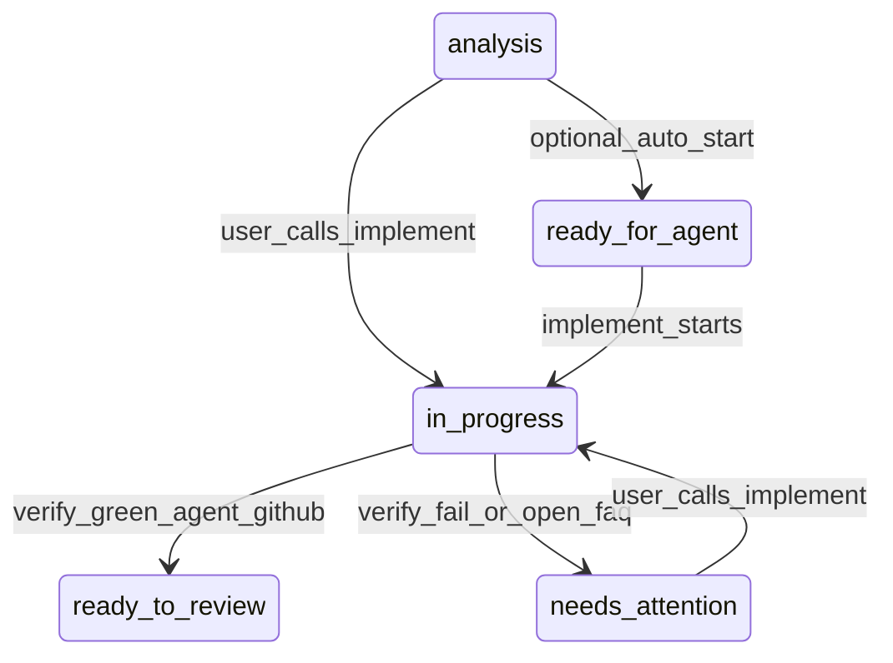

# Engineering Skills

Composable agent skills for structured feature delivery. Based on [mattpocock/skills](https://github.com/mattpocock/skills).

## What this is

Architecture and contracts are the spec — not a prose specification document. `/analyze` fixes the decisions that are expensive to reverse (layers, data flow, API contracts) plus a testable `## Acceptance`; how the code gets written is left to the implementing agents. The human decides at the start and approves at the end.

Built for **brownfield, incremental work in an existing repository** with tests, CI and documented conventions.

**Not for:** vibe coding, greenfield prototypes and spikes, one-off scripts, or trivial fixes (see `## When to use the pipeline`). Five phases and a published analysis carry real overhead — it pays off when the change crosses more than one seam or more than one package, and when someone other than the author has to review it.

## Pipeline

| Phase | Skill | Output |
|-------|-------|--------|
| 0 | `/setup` | `docs/agents/workflow.md`, `issue-tracker.md`, `domain.md` + `## Agent skills` block + pipeline skills copied to `.cursor/skills/` if missing |
| 1–2 | `/align` | Shared understanding; optional `docs/adr/` updates |
| 3 | `/analyze` | Analysis published (`analysis` on GitHub, or `.scratch/analysis/NNN-<slug>.md`) + `## Delivery` (Kind, branch, branch-owner, push) |
| 4 | `/implement #N` | Sub-agents implement from the analysis (code + tests); parent commits; then `/verify` |
| 5 | `/verify` | Closer: Spec/Standards/tests (hard findings committed); **agent** ready PR if green, draft PR if fail (notes on analysis); **human** stay on HEAD |

**Helpers during implement:** `tdd`, `integration-tests` (Symfony HTTP), `commit`.

**Outside the feature pipeline:** `git-release`, `monorepo-update`.

Human work is at the start (align + review the published analysis) and at the end (check the PR / HEAD). In between, agents implement, test, run tooling, and leave a clean tree.

## Analysis lifecycle

Happy path: review the published analysis, then `/implement`. GitHub `ready-for-agent` is only for auto-start without the user. User-invoked `/implement` does not require that label.



`ready-to-review` only after an **agent** verify that opened a **ready** PR. Verify fail (agent): **draft** PR, `needs-attention`, comment on the analysis — never on the PR. **human** GitHub: green leaves `in-progress` and the user opens the PR; a fail sets `needs-attention`. Local: no GitHub labels — file in `.scratch/analysis/` is ready; after green verify, `mv` to `.scratch/analysis/done/` (fail stays in `.scratch/analysis/`).

`needs-attention` means the agent stopped and cannot continue on its own: verify red after 3 cycles, a hard stop, or remaining work blocked by an open `## FAQ`. It **replaces** `in-progress`, so auto-start will not pick the analysis up again and `gh issue list` shows what is actually waiting on you. Answer the FAQ or fix what the comment reports, then re-run `/implement` — that swaps the state back to `in-progress`. A dead session is different: it keeps `in-progress`, because re-running `/implement` is enough.

- `/implement` spawns sub-agents from the analysis (Architecture `###` subsections speed up the split; a flat Architecture still uses agents). Parent commits. Progress is `## Acceptance` checkboxes — no ticket comment per part. Open FAQ: do not invent answers; implement decided parts only.
- When decided parts are done, `/implement` runs `/verify` in the same session.
- `/verify` closes the work (hard Spec/Standards/test findings committed), then **agent** pushes and opens a PR (ready if green, draft if fail); **human** stays on HEAD. Comments only on the analysis. In a monorepo, PRs only in sub-repos; the container root stays on `main`. `/monorepo-update` with no args bumps submodule pointers after sub-repo PRs merge; `/monorepo-update #N` checks out that analysis Delivery branch in every delivery root for human review.

## Setup presets

| Preset | Tracker | branch-owner | push | Typical use |
|--------|---------|--------------|------|-------------|
| `full-agentic` | github | agent | finalize | Agent creates branch; ready PR if verify is green, draft PR if it fails |
| `human-owned` | github | human | never | You create the branch; agent stays on HEAD and does not push |
| `custom` | user choice | user choice | user choice | Tracker, branch-owner, push individually |

`/setup` **always** asks **language** (`en` | `cs`), including with a preset — stored in `docs/agents/workflow.md` as `language`. Section headings stay English; analysis prose and ticket comments use that language.

**Issue tracker backends:** GitHub (`gh`), Local (`.scratch/`), or **Both** (active backend in `issue-tracker.md` + reference copies).

Per-repo config lives in `docs/agents/workflow.md`. Pipeline skills sit **one folder per skill** at the pack root (Claude Code does not load nested category folders). `/setup` vendors those into the target repo at `.cursor/skills/` when they are not already there (does not overwrite existing copies). Personal image skills live under [images/](images/) and are not vendored.

## When to use the pipeline

| Work type | `/align` | `/analyze` | `/implement` |
|-----------|----------|------------|--------------|
| New feature | recommended | analysis | agents + verify |
| Complex bug | if root cause unclear | analysis (`Kind: bug`) | yes |
| Simple bug | skip | issue + Acceptance | yes |
| Trivial fix | — | — | direct fix, outside pipeline |

**Bug fast-path:** create a ticket with Acceptance. `/implement` implements from the ticket body.

## Context hygiene

1. Run **align → analyze** in one context window when the feature still needs decisions. Publish even if FAQ is open (persist for later).
2. `/implement` on the analysis: one session for the whole analysis. Sub-agents write code and tests. Resume from `in-progress` if the session dies.
3. `/verify` runs automatically at the end of implement. **agent:** push + CI + ready PR (green) or draft PR (fail); notes on the analysis. **human:** stay on HEAD; user pushes.
4. In monorepos, verify checkouts affected delivery roots before diffing; the container root stays on `main` and is never a delivery root. GitHub analyses/issues always live on the container-root repo (`gh -R`), not in delivery-root repos.

## branch-owner

- **agent** — `git fetch origin`; create the Delivery branch from `origin/<default>` (`--no-track`); if it exists, checkout + `git pull --rebase`
- **human** — stay on current branch; you create the branch before `/implement`

**Session override:** `/implement #42 human` or `/implement #42 agent` overrides branch-owner for one session.

**Failure recovery:** if a session ends mid-analysis, the analysis stays `in-progress`. Re-run `/implement` to resume.

## Definition of Done

**Per part (implement):** relevant tests green, intentional diff only, then commit.

**Verify gate (before human merge):**

| Gate | What to verify |
|------|----------------|
| Acceptance | Every item in analysis `## Acceptance` satisfied (decided parts) and proven by a test |
| Spec / Standards | Sub-agent fix-list vs analysis (Acceptance, Change, API Contracts) and repo conventions; hard findings committed |
| Tests | Full relevant suite green |
| Tooling | Commands from target repo `AGENTS.md` (e.g. `make cs-fix`, `make phpstan`, `npx vue-tsc`) |
| CI | **agent** path: `gh run watch` when GitHub Actions exist. **human:** skip |
| Git | `git status` / `git diff` show only intentional changes |

## Issue tracker

GitHub (`gh`) or local (`.scratch/analysis/NNN-<slug>.md`; finished work in `.scratch/analysis/done/`). Configured by `/setup`. Skills read `docs/agents/issue-tracker.md`. Language (`en` | `cs`) lives in `docs/agents/workflow.md` as `language`.

## Layout

Pipeline skills are one folder per skill at the pack root (required for Claude Code). The skill name is that folder.

**Pipeline** (`/setup` vendors these into `.cursor/skills/`):

```
setup/              — per-repo tracker, git workflow, domain doc layout
align/              — alignment interview; no analysis here
analyze/            — conversation → published analysis
implement/          — sub-agents implement from analysis; parent commits, then verify
verify/             — Closer: Functional (Spec + Standards + tests) [→ UX] → Ship
ux-review/          — Phase 2 of /verify (if enabled)
commit/             — Conventional Commits (English)
tdd/                — red-green-refactor
integration-tests/  — Symfony HTTP integration tests
git-release/        — semver tag + GitHub release
monorepo-update/    — sync delivery roots / checkout analysis branch
```

**Personal** (not vendored; Cursor loads these recursively):

```
images/img/         — generate or regenerate assets (`/img`)
images/img-upscale/ — Real-ESRGAN 4× upscale (`/img-upscale`)
```

Helpers during implement/verify: `tdd`, `integration-tests`, `commit`, `ux-review`. Outside the feature loop: `git-release`, `monorepo-update`.

## Installation

Symlink or clone into `~/.cursor/skills/` (Cursor) or the equivalent for Claude Code:

```bash
git clone git@github.com:{owner}/{repository}.git ~/.cursor/skills
```

Replace `{owner}` and `{repository}` with your GitHub user/org and repo name (often `skills`).

Cursor and Claude Code load `SKILL.md` from each immediate child of `~/.cursor/skills/` (and of a project `.cursor/skills/`).
