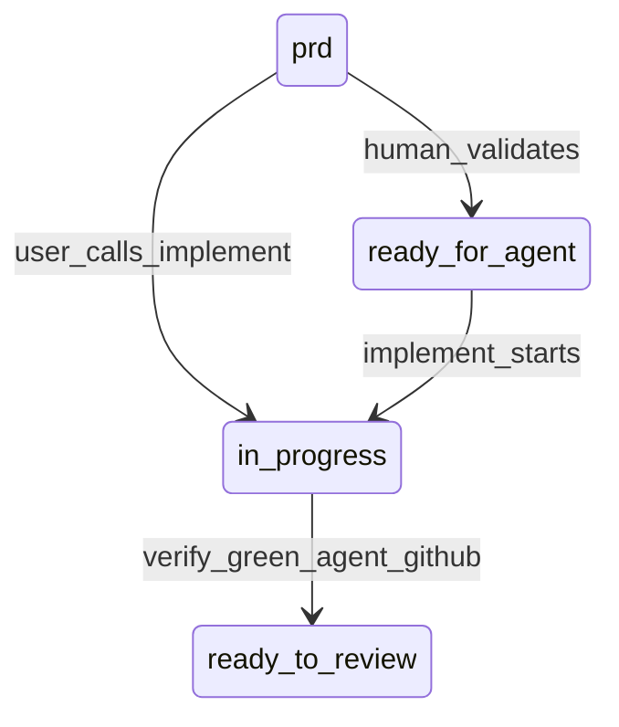

# Engineering Skills

Composable agent skills for structured feature delivery. Based on [mattpocock/skills](https://github.com/mattpocock/skills).

## Pipeline

| Phase | Skill | Output |
|-------|-------|--------|
| 0 | `/setup` | `docs/agents/workflow.md`, `issue-tracker.md`, `domain.md` + `## Agent skills` block + pipeline skills copied to `.cursor/skills/development/` if missing |
| 1–2 | `/align` | Shared understanding; optional `docs/adr/` updates |
| 3 | `/to-prd` | PRD published (`prd` on GitHub, or `.scratch/prd/NNN-<slug>.md`) + `## Delivery` (branch, branch-owner, push) |
| 4 | `/implement #PRD` | Plan increments; parent does small work, sub-agents only for large changes; then `/verify` |
| 5 | `/verify` | Spec vs PRD, Standards, tests, tooling; then **agent** push + CI + PR, or **human** stay on HEAD |

**Helpers during implement:** `tdd`, `integration-tests` (Symfony HTTP), `commit`.

**Outside the feature pipeline:** `git-release`, `monorepo-update`.

## PRD lifecycle

The human adds GitHub `ready-for-agent` after validating the PRD so an auto-trigger will not implement an undecided ticket. User-invoked `/implement` does not require that label.



`ready-to-review` only after an **agent** verify that opened a PR. **human** GitHub: leave `in-progress`; user opens the PR. Local: no GitHub labels — file in `.scratch/prd/` is ready; after verify, `mv` to `.scratch/prd/done/`.

- `/implement` plans internal increments from PRD AC. Parent does small work; sub-agents only for large changes. The parent commits.
- When all AC are done, `/implement` runs `/verify` in the same session.
- `/verify` runs the shared gate (Spec, Standards, tests), then **agent** pushes and opens PRs; **human** stays on HEAD. In a monorepo, PRs only in sub-repos; the container root stays on `main`. `/monorepo-update` with no args bumps submodule pointers after sub-repo PRs merge; `/monorepo-update #N` checks out that PRD's Delivery branch in affected delivery roots for human review.

## Setup presets

| Preset | Tracker | branch-owner | push | Typical use |
|--------|---------|--------------|------|-------------|
| `full-agentic` | github | agent | finalize | Agent creates branch; push + PR after verify is green |
| `human-owned` | github | human | never | You create the branch; agent stays on HEAD and does not push |
| `custom` | user choice | user choice | user choice | Tracker, branch-owner, push individually |

`/setup` **always** asks **PRD language** (`en` | `cs`), including with a preset — stored in `docs/agents/workflow.md`. Section headings stay English; PRD prose and ticket comments use that language.

**Issue tracker backends:** GitHub (`gh`), Local (`.scratch/`), or **Both** (active backend in `issue-tracker.md` + reference copies).

Per-repo config lives in `docs/agents/workflow.md`. The personal pack lives in `~/.cursor/skills`. `/setup` vendors [development/](development/) skills into the target repo at `.cursor/skills/development/` when they are not already there (does not overwrite existing copies). It does not copy [images/](images/).

## When to use the pipeline

| Work type | `/align` | `/to-prd` | `/implement` |
|-----------|----------|-----------|--------------|
| New feature | recommended | PRD | orchestrator + verify |
| Complex bug | if root cause unclear | PRD (`Kind: bug`) | yes |
| Simple bug | skip | issue + AC | yes |
| Trivial fix | — | — | direct fix, outside pipeline |

**Bug fast-path:** create a ticket with acceptance criteria. `/implement` implements AC from the ticket body.

## Context hygiene

1. Run **align → to-prd** in one context window when the feature still needs decisions.
2. `/implement` on the PRD: one session for the whole PRD. Small increments in the parent; sub-agents only for large ones. Resume from `in-progress` if the session dies.
3. `/verify` runs automatically at the end of implement. **agent:** push + CI + PR. **human:** stay on HEAD; user pushes.
4. In monorepos, verify checkouts affected delivery roots before diffing; the container root stays on `main` and is never a delivery root. GitHub PRDs/issues always live on the container-root repo (`gh -R`), not in delivery-root repos.

## branch-owner

- **agent** — checkout/create branch from PRD `## Delivery`, `git pull --rebase`
- **human** — stay on current branch; you create the branch before `/implement`

**Session override:** `/implement #42 human` or `/implement #42 agent` overrides branch-owner for one session.

**Failure recovery:** if a session ends mid-PRD, the PRD stays `in-progress`. Re-run `/implement` to resume.

## Definition of Done

**Per increment (implement):** relevant tests green, intentional diff only, then commit.

**Verify gate (before human review):**

| Gate | What to verify |
|------|----------------|
| Acceptance criteria | Every item in the PRD `## Acceptance criteria` satisfied |
| Spec / Standards | Sub-agent review vs PRD and repo conventions; hard findings fixed |
| Tests | Full relevant suite green |
| Tooling | Commands from target repo `AGENTS.md` (e.g. `make cs-fix`, `make phpstan`, `npx vue-tsc`) |
| CI | **agent** path: `gh run watch` when GitHub Actions exist. **human:** skip |
| Git | `git status` / `git diff` show only intentional changes |

## Issue tracker

GitHub (`gh`) or local (`.scratch/prd/NNN-<slug>.md`; finished work in `.scratch/prd/done/`). Configured by `/setup`. Skills read `docs/agents/issue-tracker.md`. PRD language (`en` | `cs`) lives in `docs/agents/workflow.md`.

## Layout

Category folders are organizational only. Cursor walks the pack recursively and loads every `SKILL.md`. The skill name is the folder that contains `SKILL.md` (`images/img` is still `/img`).

```
development/   — feature pipeline + helpers; `/setup` vendors these
images/        — personal image skills; not vendored
```

Lists: [development/README.md](development/README.md), [images/README.md](images/README.md).

## Installation

Symlink or clone into `~/.cursor/skills/` (Cursor) or the equivalent for Claude Code:

```bash
git clone git@github.com:{owner}/{repository}.git ~/.cursor/skills
```

Replace `{owner}` and `{repository}` with your GitHub user/org and repo name (often `skills`).

Cursor auto-loads nested `SKILL.md` files under `~/.cursor/skills/`.
