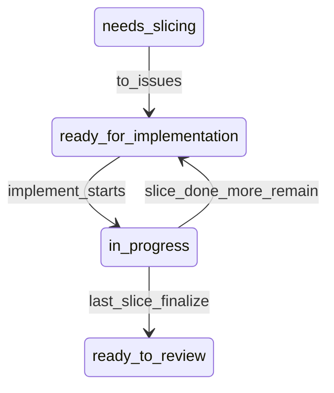

# Engineering Skills

Composable agent skills for structured feature delivery. Based on [mattpocock/skills](https://github.com/mattpocock/skills).

## Pipeline

| Phase | Skill | Output |
|-------|-------|--------|
| 0 | `/setup` | `docs/agents/workflow.md`, `issue-tracker.md`, `domain.md` + `## Agent skills` block in `CLAUDE.md` or `AGENTS.md` |
| 1–2 | `/align` | Shared understanding; optional `CONTEXT.md` / ADR updates |
| 3 | `/to-prd` | PRD published with `needs-slicing` + `## Delivery` (branch, epic, branch-owner, push) |
| 4 | `/to-issues` | Vertical slice issues + PRD → `ready-for-implementation` |
| 5 | `/implement #PRD` | **One slice**, TDD + mandatory DoD verify, handoff or finalize |
| 6 | `/to-review` | Parallel Standards + Spec report; PR opened during implement finalize when applicable |

**Outside the pipeline:** `git-release`, `integration-tests` (Symfony HTTP integration tests), `tdd` (model-invoked during implement).

## PRD lifecycle

The trigger label `ready-for-implementation` lives on the **PRD only** (or a single-slice bug ticket), never on slice issues.



- Slice issues grouped by `epic-<N>` (GitHub) or `.scratch/<slug>/issues/` (local)
- Handoff cycle: `ready-for-implementation` → agent starts → `in-progress` → slice done → `ready-for-implementation` again (or `ready-to-review` when finished)
- Finalize (last slice): run `/to-review`, push per policy, open PR, PRD → `ready-to-review`

## Setup presets

| Preset | Tracker | branch-owner | push | Typical use |
|--------|---------|--------------|------|-------------|
| `full-agentic` | github | agent | each-slice | Agent creates branch, pushes after each slice, multi-agent handoff |
| `human-owned` | github | human | never | You create the branch; agent stays on HEAD and does not push |
| `custom` | user choice | user choice | user choice | Answer the three setup questions individually |

**Issue tracker backends:** GitHub (`gh`), Local (`.scratch/`), or **Both** (active backend in `issue-tracker.md` + reference copies).

Per-repo config lives in `docs/agents/workflow.md`. This skills repo is shared across machines (`~/.cursor/skills`).

## When to use the pipeline

| Work type | `/align` | `/to-prd` | `/to-issues` | `/implement` |
|-----------|----------|-----------|--------------|--------------|
| New feature | recommended | PRD | slices | one slice per session |
| Complex bug | if root cause unclear | PRD (`Kind: bug`) | if multi-step | yes |
| Simple bug | skip | issue + AC | skip | yes (single-slice mode) |
| Trivial fix | — | — | — | direct fix, outside pipeline |

**Bug fast-path:** create a ticket with acceptance criteria and set `ready-for-implementation` without slicing. `/implement` implements AC directly when no slice issues exist.

## Context hygiene

1. Run **align → to-prd → to-issues** in one context window
2. After **to-issues**, start a **new session** on the PRD for `/implement` — each agent handles exactly one slice
3. Agent passes the DoD gate after each slice; push per `workflow.md` (`each-slice` | `finalize` | `never`)
4. **`/to-review`** runs after the last slice (during implement finalize)

## branch-owner

- **agent** — checkout/create branch from PRD `## Delivery`, `git pull --rebase`
- **human** — stay on current branch; you create the branch before `/implement`

**Session override:** `/implement #42 human` or `/implement #42 agent` overrides branch-owner for one session.

**Failure recovery:** if a session ends mid-slice, the PRD stays `in-progress`. Manually restore `ready-for-implementation` to resume.

## Definition of Done (implement)

All gates must pass before commit, push, or handoff:

| Gate | What to verify |
|------|----------------|
| Acceptance criteria | Every item in the slice/PRD `## Acceptance criteria` satisfied |
| Tests | Full relevant suite green |
| Tooling | Commands from target repo `AGENTS.md` (e.g. `make cs-fix`, `make phpstan`, `npx vue-tsc`) |
| Linter | No new diagnostics in touched files |
| Git | `git status` / `git diff` show only intentional changes |

## Issue tracker

GitHub (`gh`) or local (`.scratch/`). Configured by `/setup`. Skills read `docs/agents/issue-tracker.md`.

## Skills in this repo

```
setup/              — per-repo tracker, git workflow, domain doc layout
align/              — alignment interview; no PRD here
to-prd/             — conversation → published PRD (needs-slicing)
to-issues/          — PRD → tracer-bullet vertical slices
implement/          — one slice, DoD verify, handoff via PRD label toggle
to-review/          — Standards + Spec parallel sub-agent review
tdd/                — (model-invoked) red-green-refactor discipline
integration-tests/  — (model-invoked) Symfony HTTP integration test playbook
git-release/        — semver tag + GitHub release; user must confirm version
```

### Outside the pipeline

- **`git-release`** — any repo with `gh`; mandatory version confirmation before tagging; English release notes
- **`integration-tests`** — invoked during implement for PHP backend HTTP APIs; project paths and run commands in target repo `AGENTS.md`
- **`tdd`** — invoked by implement at pre-agreed test seams

## Installation

Symlink or clone into `~/.cursor/skills/` (Cursor) or the equivalent for Claude Code:

```bash
git clone git@github.com:{owner}/{repository}.git ~/.cursor/skills
```

Replace `{owner}` and `{repository}` with your GitHub user/org and repo name (often `skills`).

Cursor auto-loads each `*/SKILL.md`.
