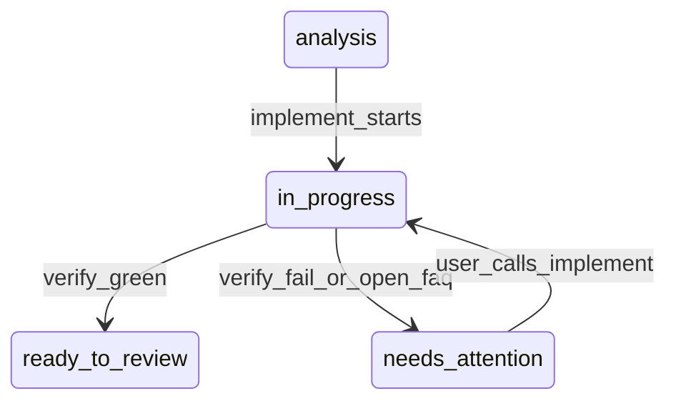

# Enterprise Engineering Skills

Agent skills for delivering features in an existing codebase: architecture and contracts are the spec, agents write the code and the tests, and each change arrives as verified local work or an agent-managed PR.

## Why

Agents are already good at implementation. They read the surrounding code, follow its idioms and rarely need to be told how to write a class — so spelling out the how is effort spent on something that goes stale the moment the code moves.

What an agent cannot take over is **responsibility**. I stay accountable for the project, so I own the boundaries: architecture, seams, contracts. Everything inside them is the agents' work.

The point is understanding, not just working code. Because I define the inputs and outputs myself, I know what crosses every seam, I can explain the whole flow, and I can answer to the business without first re-reading the diff — which in enterprise work matters more than raw speed. That is where this differs from spec-driven development: the goal is not "it does what I asked for", it is "I understand what it does and can stand behind it".

## What this is

`/analyze` fixes only the decisions that are expensive to reverse — layers, data flow, API contracts — plus a testable `## Acceptance`. How the code gets written is left to the implementing agents. You decide at the start and approve at the end.

Built for **brownfield, incremental work** in a repository that has tests, CI and documented conventions. Aligning, publishing an analysis and gating the result costs real time; it pays off when a change crosses more than one seam or package, and when someone other than the author has to review it.

**Not for** vibe coding, greenfield prototypes and spikes, one-off scripts, or trivial fixes.

## Pipeline

| Phase | Skill | Output |
|-------|-------|--------|
| 0 | `/setup` | `docs/agents/workflow.md`, `issue-tracker.md`, `domain.md`; vendors pipeline skills into the repo's skills dir (`.cursor/skills`, `.claude/skills`, …) |
| 1 | `/align` | Shared understanding; `docs/adr/` when a decision has real trade-offs |
| 2 | `/analyze` | Published analysis (architecture, API contracts, Acceptance) + `## Delivery` |
| 3 | `/implement #N` | Parent orchestrates test sub-agents → test-only commits → fresh implementation sub-agents → implementation commits → automatic verify |
| 4 | `/verify` | Acceptance, standards, tests, tooling, code review, CI; findings fixed by sub-agents; push/CI per policy; PR only for agent-owned delivery |

You invoke the workflow locally: align, publish and review the analysis, then run implement. Align and analyze can share conversation history. Implement uses the published analysis and keeps the main window for orchestration; workers get fresh contexts with scoped tasks. At the end you review the current branch or the agent-managed PR.

| Work type | `/align` | `/analyze` | `/implement` |
|-----------|----------|------------|--------------|
| New feature | recommended | analysis | agents + verify |
| Complex bug | if root cause unclear | analysis (`Kind: bug`) | yes |
| Simple bug | skip | ticket with Acceptance | yes |
| Trivial fix | — | — | direct fix, outside the pipeline |

## Analysis lifecycle


```mermaid
stateDiagram-v2
    analysisPublished: analysis
    inProgress: in_progress
    needsAttention: needs_attention
    readyToReview: ready_to_review

    analysisPublished --> inProgress: implement_starts
    inProgress --> readyToReview: verify_green
    inProgress --> needsAttention: verify_fail_or_open_faq
    needsAttention --> inProgress: user_calls_implement
```

`ready-to-review` means verify completed successfully. Human-owned delivery is ready on the current branch; agent-owned delivery includes a ready PR when push/PR operations are enabled. The analysis comment records local verification, push and CI separately. `needs-attention` means the agent stopped and cannot continue alone — verify red after three cycles, a hard stop, or work blocked by an open `## FAQ`; it replaces `in-progress` so auto-start leaves it alone. Answer what the comment asks and re-run `/implement`. A dead session keeps `in-progress`, because re-running `/implement` is enough.

Notes always go on the analysis, never on the PR. On GitHub these states are labels; locally they are the `Status:` line in `.scratch/analysis/NNN-<slug>.md`.

## Configuration

`/setup` writes per-repo config to `docs/agents/workflow.md` and offers a preset:

| Preset | Tracker | branch-owner | push |
|--------|---------|--------------|------|
| `full-agentic` | github | agent | finalize |
| `human-owned` | github | human | finalize |
| `custom` | user choice | user choice | user choice |

Branch ownership and push are independent: human-owned keeps the current branch and leaves PR management to the user, while the agent can push and check CI after verification. `push: never` and session instructions such as “do not push” take precedence in every mode, including failed delivery. Existing repo settings remain explicit until setup is rerun.

Setup records **language** (`en` \| `cs`) — analysis prose and ticket comments use it, section headings stay English. Issue tracker is GitHub (`gh`), local (`.scratch/`), or both. UX review is an optional hard gate inside `/verify`.

## Skills

One folder per skill at the pack root — Claude Code does not load nested category folders. `/setup` vendors the pipeline ones into the target repo.

```
setup/              — per-repo tracker, git workflow, domain doc layout
align/              — alignment interview; no analysis here
analyze/            — conversation to published analysis
implement/          — orchestrates tests, test commits, implementation agents and verify
verify/             — Acceptance, standards, tests, tooling, code review, UX, CI, then ship
code-review/        — fix-first code review, phase 2 of /verify
ux-review/          — browser UX gate, phase 3 of /verify
tdd/                — red-green-refactor
integration-tests/  — Symfony HTTP integration tests
commit/             — Conventional Commits (English)
git-release/        — semver tag + GitHub release
monorepo-update/    — sync delivery roots / checkout an analysis branch
```

`tdd`, `integration-tests`, `commit`, `code-review` and `ux-review` are helpers called during implement and verify. `setup`, `git-release` and `monorepo-update` sit outside the feature loop and stay in the shared pack — they are not vendored into repos.

## Sub-agents

Use the runner's sub-agent facility with a fresh context for each role. Pass the assigned Acceptance items, relevant contracts and architecture, allowed paths, skill paths, and project commands; workers read source files themselves. Avoid copying the whole parent conversation.

Test agents write tests and report expected RED or already-green regression cases. The parent reviews coverage and commits tests before any production implementation. New implementation agents satisfy that committed baseline. Test corrections require a documented reason, parent review and a separate test commit; never weaken assertions to make code pass.

The main window schedules work, reviews results, runs checks, commits, updates the analysis and invokes verify. Sub-agents handle tests, implementation and substantial fixes; the parent may handle a trivial one-file follow-up. Workers do not manage git delivery. Parallel workers need disjoint write paths and isolated databases, fixtures, ports and browser sessions, or those operations run sequentially.

## Installation

Use the shared pack in `~/.codex/skills/`, `~/.agents/skills/`, `~/.cursor/skills/` or `~/.claude/skills/`, according to your runner. For example:

```bash
git clone git@github.com:rdurica/enterprise-engineering-skills.git ~/.cursor/skills
```

Project instructions live in `AGENTS.md`. The pack uses one skill per directory. `/setup` reuses the configured `skills-dir` or a single existing vendored installation. Otherwise the user selects a path their harness loads; there is no fallback based on editor config folders. Custom paths are supported and recorded in `docs/agents/workflow.md`. A gitignored `personal/` folder is the place for local-only skills.
