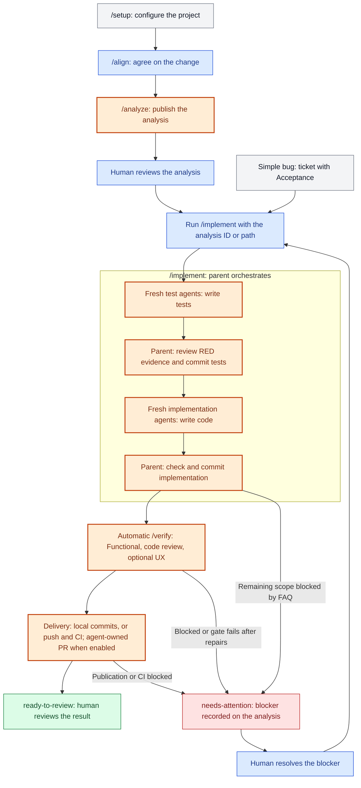

# Enterprise Engineering Skills

Agent skills for incremental changes in an existing codebase. You own the decisions and contracts; agents write tests, implement the change and verify the result. Delivery is verified local work or an agent-managed PR, depending on the project configuration.

## Why

Working code is only part of the goal. Whoever owns the project must understand the change and be able to explain it. This workflow puts that understanding first: agree on the behaviour, architecture and boundaries, then let agents handle implementation inside them.

Built for repositories with tests and documented conventions, especially changes that cross modules or need review by someone other than the author. Trivial fixes can go directly through the project's normal workflow.

## Process

Run `/setup` once in the target project, then:

1. **`/align`** — explore the code and resolve decisions together. Record durable trade-offs in ADRs.
2. **`/analyze`** — publish the agreed change and its Acceptance criteria. Current State and Change each explain the behaviour in 2–4 short sentences; implementation details belong in Architecture and API Contracts. Mermaid diagrams highlight affected parts in orange.
3. **Review the analysis**, then run **`/implement #N`** or pass a local analysis path.
4. **`/implement` orchestrates the work** — fresh test agents write tests; the parent reviews RED evidence and commits the tests. Fresh implementation agents then write production code; the parent checks and commits it.
5. **`/verify` runs automatically** — Functional checks, code review, optional UX review, then delivery according to branch ownership and push policy. You review the result.


```mermaid
flowchart TD
    Setup["/setup: configure the project"] --> Align["/align: agree on the change"]
    Align --> Analyze["/analyze: publish the analysis"]
    Analyze --> Review["Human reviews the analysis"]
    Review --> Start["Run /implement with the analysis ID or path"]
    Bug["Simple bug: ticket with Acceptance"] --> Start

    subgraph Implement["/implement: parent orchestrates"]
        Tests["Fresh test agents: write tests"] --> TestCommit["Parent: review RED evidence and commit tests"]
        TestCommit --> Code["Fresh implementation agents: write code"]
        Code --> CodeCommit["Parent: check and commit implementation"]
    end
    Start --> Tests
    CodeCommit --> Verify["Automatic /verify: Functional, code review, optional UX"]
    Verify --> Deliver["Delivery: local commits, or push and CI; agent-owned PR when enabled"]
    Deliver --> Ready["ready-to-review: human reviews the result"]
    Verify -->|"Blocked or gate fails after repairs"| Attention["needs-attention: blocker recorded on the analysis"]
    Deliver -->|"Publication or CI blocked"| Attention
    CodeCommit -->|"Remaining scope blocked by FAQ"| Attention
    Attention --> Resolve["Human resolves the blocker"]
    Resolve --> Start

    classDef default fill:#f3f4f6,stroke:#6b7280,color:#111827
    classDef human fill:#dbeafe,stroke:#1d4ed8,color:#1e3a8a
    classDef automated fill:#ffedd5,stroke:#c2410c,stroke-width:2px,color:#7c2d12
    classDef ready fill:#dcfce7,stroke:#15803d,color:#14532d
    classDef blocked fill:#fee2e2,stroke:#b91c1c,color:#7f1d1d
    class Align,Review,Start,Resolve human
    class Analyze,Tests,TestCommit,Code,CodeCommit,Verify,Deliver automated
    class Ready ready
    class Attention blocked
```

Blue = human decisions and invocation; orange = agent work; green = ready for review; red = needs attention.

For a **complex bug**, use the same flow, with `/align` when the root cause is unclear and `Kind: bug` in the analysis. A **simple bug** starts with a ticket containing Acceptance and goes straight to `/implement`. You can also invoke `/verify` directly for work with an existing analysis.

## Tracking and resume

Publishing an analysis does not start implementation. On GitHub it has the `analysis` label; a new local analysis has no Status line. User-invoked `/implement` needs no `ready-for-agent` label; that label is only for optional auto-start.

- **`in-progress`** — implementation is running. An interrupted session stays here; re-run `/implement` to resume from the analysis and git state.
- **`needs-attention`** — a blocker requires a decision or fix. It replaces `in-progress`. Resolve the reported blocker and re-run `/implement`. An open FAQ permits work on decided scope, but unfinished scope cannot be verified as complete.
- **`ready-to-review`** — all applicable gates passed. Local analyses move to `docs/agents/analysis/done/`; GitHub analyses receive the label. This records verified delivery, not a merge or human approval.

Progress and verification notes go on the analysis, never on the PR. The final note distinguishes local checks, publication and CI, including anything skipped.

## Configuration

`/setup` writes `docs/agents/config/workflow.md`, tracker configuration and domain documentation, and updates the Agent skills block in `AGENTS.md`. On every run, you choose whether to use global skills or copy the pipeline into the project; the saved choice is preselected.

Agent files share `docs/agents/`: configuration and project-specific instruction overlays live in `config/`, active local analyses in `analysis/`, and completed analyses in `analysis/done/`. Workflow `local-path` points to `docs/agents/config/`, not the analysis directory. Setup preserves analyses when refreshing configuration. Projects choose whether to version these files; setup does not automatically ignore, stage or commit them.

Choose **full-agentic** for agent-managed branches and PRs, **human-owned** to stay on your current branch and manage PRs yourself, or **custom** to select settings individually. Both presets default to GitHub and `push: finalize`; human-owned can use the local tracker.

- **Branch ownership:** `agent` uses the analysis Delivery branch and manages PRs; `human` stays on the current branch and leaves PRs to you.
- **Push policy:** `finalize` permits push and CI during delivery; `never` keeps local commits and skips push, CI watches and PR changes. Session instructions such as “do not push” override the defaults.
- **Tracker:** GitHub or Local Markdown in `docs/agents/analysis/`. Setup can keep reference configurations for both, with one active backend.
- **Language:** `en` or `cs` for analysis prose and tracker comments; section headings remain English.
- **UX review:** optional browser gate after code review; skipped for changes without UI.
- **Skills mode:** `global` uses the shared pack installed in your runner; `vendored` copies the pipeline into a confirmed project directory and refreshes it on every `/setup`. New projects default to the global recommendation; existing configuration with only `skills-dir` defaults to project copies.

Agent-owned delivery produces a ready PR after green checks, or may retain a draft PR on failure when publication is allowed. Human-owned delivery never manages PRs. In monorepos, analyses live at the container root and implementation happens in delivery roots; submodule pointer updates remain a human step.

## Skills and agents

The project pipeline is `/align` → `/analyze` → `/implement`, with `/verify` called automatically. Its helpers are `tdd`, `integration-tests` for Symfony HTTP tests, `commit`, `code-review` and `ux-review`. In vendored mode, `/setup` copies those nine skills; in global mode, they stay in the shared pack. `setup`, `git-release` and `monorepo-update` always remain in the shared pack.

The parent agent schedules work, reviews results, runs checks, commits and handles delivery. Workers get fresh contexts with scoped Acceptance, architecture, contracts and allowed paths. They never commit, push or manage PRs. Parallel work requires disjoint write paths and isolated mutable resources.

Tests are committed before production implementation. Later test corrections need a concrete reason, parent review and a separate test commit; assertions must not be weakened to make faulty code pass. Verify fixes actionable findings within scope and stops on blockers or exhausted repair limits.

## Installation

Install the shared pack in the skills directory loaded by your runner. Codex discovers user skills in `~/.agents/skills/`; Cursor and Claude Code use their respective skills directories. For example, when the destination does not already exist:

```bash
git clone git@github.com:rdurica/enterprise-engineering-skills.git ~/.agents/skills
```

If the checkout already lives elsewhere, such as `~/.codex/skills/`, expose each maintained skill through a symlink inside `~/.agents/skills/` instead of copying it. For example: `ln -s ~/.codex/skills/analyze ~/.agents/skills/analyze`. Link each versioned folder containing `SKILL.md`; exclude `.system` and `personal`, and preserve existing unrelated skills. Reuse correct links and resolve name collisions before replacing anything. Codex follows symlinked skill folders. Verify the skills appear in `/skills` in a new Codex session before removing project copies; restart Codex if discovery has not refreshed.

Run `/setup` inside the target project and choose global skills or project copies. Only project copies require a destination: setup reuses a configured or unambiguous existing project skills directory; otherwise you choose the path. Each skill has its own folder.

Re-run `/setup` to refresh project configuration and review the skills mode. In vendored mode, every pipeline copy is refreshed from the maintained shared pack. In global mode, `/setup` leaves that pack unchanged; update it separately. When switching to global skills, setup offers to remove existing project copies with separate confirmation; if retained, it warns that your runner may still load them. Keep project-specific additions in `docs/agents/config/`, because refresh replaces vendored copies. A gitignored `personal/` folder holds local-only skills in the shared pack.
