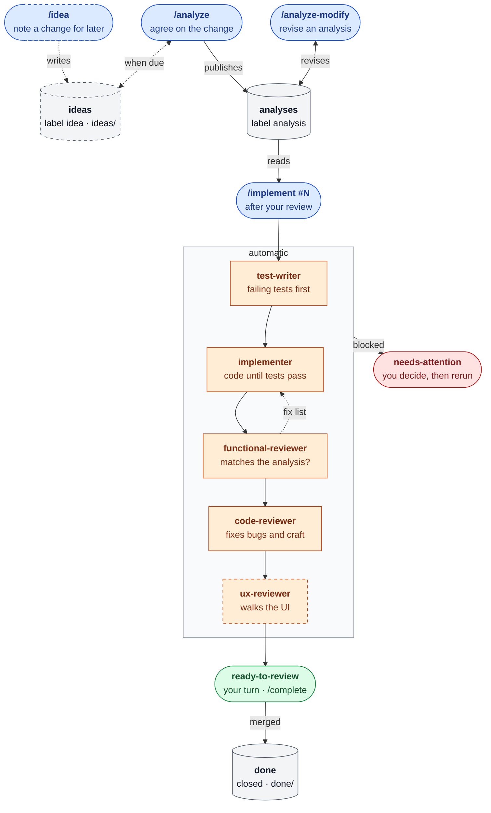

# Enterprise Engineering Skills

Claude Code skills and agents for changes in an existing codebase. You make the decisions; agents write the tests and code, review them and deliver the result.

The goal is not just working code. Whoever owns the project should understand the change well enough to explain it, so behaviour and boundaries are agreed first and implemented second. Trivial fixes skip the pipeline.

## Quick start

```bash
git clone git@github.com:rdurica/enterprise-engineering-skills.git ~/Projects/enterprise-engineering-skills
~/Projects/enterprise-engineering-skills/install.sh
```

`install.sh` links every skill into `~/.claude/skills/` and `~/.agents/skills/` (read by Codex and Cursor), and every agent into `~/.claude/agents/`, `~/.codex/agents/` and `~/.cursor/agents/` (see [Agents for each provider](#agents-for-each-provider)). It never overwrites a different skill or agent with the same name, removes dangling links left by deleted ones, points the pack's `core.hooksPath` at `.githooks`, and `--dry-run` shows the plan. Afterwards `git pull` is enough; re-run the script when a skill or agent is added, renamed or removed.

A project works without any configuration: the tracker and monorepo are detected and every other setting has a built-in default. Optionally create your personal defaults in the global file `~/.config/enterprise-engineering-skills/workflow.md`, either through `/setup` or by hand:

```markdown
# Agent workflow

- branch-owner: agent
- push: finalize
- language: en
- ux-review: disabled
```

## Workflow

You take part in only a few steps. Everything after `/implement #N` is a chain of agents: each one gets a fresh context, finishes one job and hands its result to the next. The main session sits between them, reviews every handoff and makes the commits.


```mermaid
flowchart TD
    Idea(["<b>/idea</b><br/>note a change for later"])
    Analyze(["<b>/analyze</b><br/>agree on the change"])
    Modify(["<b>/analyze-modify</b><br/>revise an analysis"])
    Ideas[("<b>ideas</b><br/>label idea · ideas/")]
    Analyses[("<b>analyses</b><br/>label analysis")]
    Implement(["<b>/implement #N</b><br/>after your review"])

    subgraph Auto["automatic"]
        direction TB
        testWriter["<b>test-writer</b><br/>failing tests first"]
        implementer["<b>implementer</b><br/>code until tests pass"]
        functional["<b>functional-reviewer</b><br/>matches the analysis?"]
        codeReview["<b>code-reviewer</b><br/>fixes bugs and craft"]
        ux["<b>ux-reviewer</b><br/>walks the UI"]

        testWriter --> implementer --> functional --> codeReview --> ux
        functional -. "fix list" .-> implementer
    end

    Ready(["<b>ready-to-review</b><br/>your turn · /complete"])
    Attention(["<b>needs-attention</b><br/>you decide, then rerun"])
    Done[("<b>done</b><br/>closed · done/")]

    Idea -. "writes" .-> Ideas
    Analyze <-. "when due" .-> Ideas
    Analyze -- "publishes" --> Analyses
    Modify <-- "revises" --> Analyses
    Analyses -- "reads" --> Implement --> testWriter
    ux --> Ready -- "merged" --> Done
    Auto -. "blocked" .-> Attention

    classDef human fill:#dbeafe,stroke:#1d4ed8,color:#1e3a8a
    classDef agent fill:#ffedd5,stroke:#c2410c,color:#7c2d12
    classDef optional stroke-dasharray:5 5
    classDef store fill:#f3f4f6,stroke:#4b5563,color:#111827
    classDef ready fill:#dcfce7,stroke:#15803d,color:#14532d
    classDef blocked fill:#fee2e2,stroke:#b91c1c,color:#7f1d1d
    class Idea,Analyze,Modify,Implement human
    class Idea,Ideas,ux optional
    class testWriter,implementer,functional,codeReview,ux agent
    class Ideas,Analyses,Done store
    class Ready ready
    class Attention blocked
    style Auto fill:#f9fafb,stroke:#9ca3af
```

**Blue** = you · **orange** = agents · **grey** = where ideas and analyses are stored (GitHub issues or `docs/agents/analysis/`) · **dashed** = optional. `/implement` continues into `/verify` on its own. Every step runs tests, lint and type checks through `check-runner`, which returns only the failures.

0. **`/idea`** (optional) — write a change down as a short idea: Goal, Change and optional `Depends on`. No code is read in depth and no decisions are settled; the detailed analysis comes later with **`/analyze #N`** on the same issue, once the change is due and against the code as it is then.
1. **`/analyze`** — you and Claude explore the code and settle decisions one question at a time. Once you confirm the list of decisions, Claude turns them into a published analysis: current state, change, architecture, API contracts and Acceptance, with each decision and its rejected alternative in Further Notes.
2. **You review it** and run **`/implement #N`** (or a local analysis path). The agents in the diagram take over: tests first, committed before any code, then the code, the functional review against the analysis, the code review and, if enabled, the UX review. It ends as `ready-to-review`, or as `needs-attention` when a decision is yours.

3. **You review the delivery** and run **`/complete #N`**. For agent-owned delivery with an open PR it checks that CI is green, nothing is a draft and no changes are requested, then rebase-merges the PR, deletes the branch, closes the issue without `ready-to-review` and pulls `main` locally. Human-owned delivery, or delivery without a PR, is left to you and `/complete` does nothing.

To **plan several follow-up changes**, write each as an idea and give it `Depends on: #41, #42` in its Delivery. `/idea` proposes dependencies from the open ideas and analyses and warns about duplicates. `/analyze #N` on an idea whose dependency is still open stops and asks whether to continue; `/implement` refuses an idea and an analysis with an unmet dependency, with no override. A dependency is met when its issue is closed (locally, its file is in `done/`).

A **simple bug** skips step 1: a ticket with Acceptance goes straight to `/implement`.

**Work without an analysis** — "add an endpoint", "fix this bug", "refactor that module" — starts the **`change`** skill on its own when the change adds behaviour or touches more than one file. It writes a short brief, then runs `test-writer`, `implementer`, `check-runner` and `code-reviewer` the same way, and commits only when you ask. A typo or one-line fix is edited directly; a large or open-ended change gets a suggestion to run `/analyze` first.

**Decisions** live only in `## Further Notes` of each analysis, each with its rejected alternative. The pack writes and reads no ADRs.

To **change an existing analysis** — before `/implement`, or after it when a change request arrives — run **`/analyze-modify #N`** with what should be different. Claude checks the analysis, decisions in earlier analyses and any committed code for what the change contradicts, names the risks and agrees each one with you, then rewrites the analysis in place so it reads as one consistent state. Changed Acceptance items are unchecked. For an analysis that is not yet implemented only the text changes; once work exists, `## Revisions` at the end records the modification as an unchecked item (an unchecked one is updated instead of adding another) and `/implement #N` continues on the same branch with only the unchecked items, then checks the revision off.

## Agents

| Agent | Used by | What it does | Model |
|-------|---------|--------------|-------|
| `test-writer` | `/implement`, `change` | Writes tests for one slice of the change and proves they fail | Sonnet, medium |
| `implementer` | `/implement`, `change`, repairs | Writes production code against the committed tests | Sonnet, medium |
| `functional-reviewer` | `/verify` | Checks Acceptance, scope, API contracts, test coverage and documented project rules (read-only) | Sonnet, medium |
| `code-reviewer` | `/code-review`, `change` | Fixes bugs and security issues, then leftovers, duplication and readability | Sonnet, medium |
| `ux-reviewer` | `/ux-review` | Walks the affected screens in a browser; checks accessibility | Sonnet, medium |
| `check-runner` | all pipeline skills, any full check run | Runs tests, lint and type checks; returns only failures | Haiku, low |

Agents never commit, push or open PRs; the main session does. Tests are committed before the code, and assertions are never weakened to make code pass.

### Agents for each provider

Each agent is written once and built for Claude Code, Codex and Cursor:

- `agents/<name>.md` holds the `name`, the `description` and the instructions.
- `agents.toml` holds every agent's settings for every provider: shared `readonly` and `skills`, then `claude` (`model`, `effort`, `tools`, `color`), `codex` (`model`, `effort`) and `cursor` (`model`, the full Cursor ID with effort, e.g. `grok-4.7-medium`). Leaving out a provider's table skips the agent for that provider.
- `scripts/build-agents` writes `generated/<provider>/agents/`, which is committed and linked by `install.sh`. Never edit `generated/` by hand; the pre-commit hook runs `scripts/build-agents --check` and refuses a commit where it is out of date.

```toml
[check-runner]
readonly = true
claude = { model = "haiku", effort = "low", tools = ["Bash", "Read", "Grep", "Glob"], color = "cyan" }
codex = { model = "gpt-6-luna", effort = "low" }
cursor = { model = "grok-4.7-low" }
```

Claude preloads `skills`; Codex and Cursor get a first line telling the agent to read them. Cursor enforces `readonly`; Codex cannot restrict tools per agent, so there read-only roles rely on their instructions. The main Codex session keeps the model from `~/.codex/config.toml`. Cursor reads skills from `~/.agents/skills/` and `~/.claude/skills/`, so nothing is linked into `~/.cursor/skills/`.

## Models

Opus is used where decisions are made; the pipeline and its agents run on Sonnet or Haiku. Keep **Opus** as your default model: unpinned work — `change`, debugging, questions — is mostly judgment and costs little.

| Skill | Model, effort |
|-------|---------------|
| `/analyze`, `/analyze-modify`, `/discuss` | Opus |
| `/idea` | Sonnet, medium |
| `/implement` | Sonnet, high |
| `/verify`, `/code-review` | Opus, medium when run directly; inside `/implement` they follow its session |
| `/ux-review`, `/git-release`, `/monorepo-update` | Sonnet, medium |
| `/setup` | Sonnet, high |
| `/commit`, `/complete` | Haiku, low |
| `change` | your selected model |

- **Opus only for decisions.** An analysis decides what every later step builds and checks, so it gets the strongest model; the pipeline then follows the agreed analysis.
- **One task per conversation.** Switching models mid-conversation throws away the prompt cache, so start each `/analyze` and each `/implement` in a fresh conversation.

How the pipeline keeps its own cost down — summaries instead of logs, checks in tiers, delta reviews and escalation on evidence — is in the Execution contract of [`implement`](skills/implement/SKILL.md#execution-contract).

Change a role's model or effort in `agents.toml` (see [Agents for each provider](#agents-for-each-provider)). `CLAUDE_CODE_EFFORT_LEVEL` overrides every Claude `effort`.

## Status

With the local tracker there is no status: an analysis in `docs/agents/analysis/` is active, an idea in `docs/agents/analysis/ideas/` is waiting for `/analyze`, and a green `/verify` moves it to `done/`. Blockers are noted under `## Comments`. On GitHub, the issue carries these labels:

| Label | Meaning |
|-------|---------|
| `idea` | An idea not yet analyzed; `/analyze #N` converts it to `analysis`, `/implement` refuses it |
| `in-progress` | `/implement` is running or was interrupted; rerun it to resume |
| `needs-attention` | A blocker needs your decision; resolve it and rerun `/implement` |
| `ready-to-review` | All gates passed; your turn to review, then `/complete` |

Notes go on the analysis, never on the PR.

## Configuration

No configuration is required. Each setting has a built-in default (agentic mode: the agent manages the branch and PR, pushes at finalize and watches CI):

| Key | Built-in value | Options |
|-----|----------------|---------|
| `branch-owner` | `agent` | `agent` (agent manages branch and PR) · `human` (stays on your branch, PRs are yours) |
| `push` | `finalize` | `finalize` (push and watch CI) · `never` (local commits only) |
| `ux-review` | `disabled` | `enabled` · `disabled` |
| `language` | conversation language for `/idea`, `/analyze` and `/analyze-modify`; the analysis language for `/implement`, `/verify` and `/complete` | `en` · `cs` for analysis prose, comments and the PR Summary |
| `tracker` | detected | `github` · `local` |
| Monorepo | detected | `## Monorepo` section (project file only) |

Each key is resolved separately and the first level that sets it wins: session (`/implement #N human|agent`, "don't push") → project file `docs/agents/config/workflow.md` → global file → built-in value or detection. The project file holds only deviations and is the only place for `tracker` and `## Monorepo`. Detection and the file format are described in [`pipeline/config.md`](skills/pipeline/config.md). `/setup` is optional: it checks the installation and writes the global file or project deviations.

Project-specific rules go in the overlays `docs/agents/config/verify.md`, `code-review.md` and `ux-review.md`. Local-only skills go in the gitignored `skills/personal/`.

## Other skills

Most skills run only as slash commands. Claude starts these on its own when the request fits: `change` (implementation without an analysis), `implement` (a request naming an analysis), `discuss` (weighing options), `tdd`, `integration-tests`, `commit` and `git-release`.

- **`change`** — implementation without an analysis through the same agents; see [Workflow](#workflow).
- **`/discuss`** — talk a question through with options and trade-offs; changes nothing.
- **`/commit`** — Conventional Commits from the diff; `/commit push` also pushes.
- **`/git-release`** — semver tag and GitHub release with a changelog.
- **`/monorepo-update`** — bump submodules or check out an analysis branch in every delivery root.
- **`tdd`**, **`integration-tests`** — testing playbooks used by `test-writer`.
- **`pipeline`** — hidden shared library (not invokable): built-in defaults, resolution order, detection and the GitHub and local tracker instructions that the pipeline skills read.
