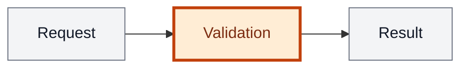

# Analysis template

Writing rules and section template for `/analyze`. Delivery and publishing follow [SKILL.md](SKILL.md).

## Writing style

Keep the analysis easy to scan. Current State and Change each use one paragraph of 2–4 short sentences in plain language. Explain behaviour and user impact there; keep class names, paths, data shapes and implementation steps in Architecture or API Contracts. Avoid repeating the same information across sections.

- Backticks are for paths, commands, HTTP routes and literal values. Class, command, DTO and event names in prose stay plain text.
- Put data shapes in fenced blueprint blocks.
- Frontend stays short when it is involved; it is not the focus.
- `## API Contracts` is omitted when there is no API.
- Summary always includes a Mermaid diagram of the behaviour.

### Mermaid highlighting

Every diagram must highlight the processes, nodes or regions being changed or added in orange; keep surrounding context neutral. Highlight only parts affected by this change, including in current-state diagrams. Add a short legend below each diagram in the analysis language: “Orange = changed or new part.”

For flowcharts, use the shared `changed` class with an orange fill and a strong border:



Orange = changed or new part.

For other Mermaid types, use their supported styling to highlight the affected region in orange. If the type cannot highlight the affected part, use a flowchart instead.

### Architecture subsections

Each `###` names one real project unit: a package, repo, module or bounded context, never a layer such as Controller or Repository or an invented unit. Use only the unit name in the heading; put `Path: <path>` on the first line below it. Omit subsections for a single-unit change.

Name shared seams between units so `/implement` can safely parallelize disjoint paths. Link supporting ADRs by path from Architecture. Decisions `/align` assigned to the analysis rather than an ADR belong in Further Notes.

## Template

<analysis-template>

## Summary

- {what changes and **why**}
- {key changes - one to three bullets}
- {Mermaid of the behaviour, affected parts in orange, with a legend — always}

## Current State

{2–4 short sentences: how the relevant behaviour works today and what problem
or limitation motivates the change. No technical inventory or extra bullets.}

## Change

{2–4 short sentences: how that behaviour will work after the change and what
the user will experience differently. Keep technical details in Architecture.}

## Architecture

{layers, data flow, decisions carried over from align or ADRs.
One `###` per real unit, path on the line below the heading.
When the schema changes, state the delta — tables and columns added or
changed, nullability, defaults, indexes — plus the migration, written by
hand, with the backfill and the rollback whenever existing rows are touched.}

## API Contracts

{one block per endpoint; omit the whole section when there is no API.
Authorization is mandatory in every block — who may call it, and the status
and error code everyone else gets.}

```
POST /api/groups/{uuid}/plan

Authorization
- group owner only; any other member 403 insufficient_permissions

Request
- string: planCode
- bool: prorate

Response 200
- string: planCode
- string: effectiveFrom (ISO-8601)

Errors
- 409 plan_downgrade_blocked
- 404 group_not_found
```

## Acceptance

{`- [ ]` list: one observable behaviour and one seam per item, with a concrete
input or trigger and expected result. Cover happy, error and boundary paths.
Each API endpoint needs a denied-caller item with its authorization status
and error code. Reference API contracts instead of repeating payloads.
Keep items separate for TDD clustering and verify; no implementation tasks
or test-writing checkboxes.

Example: - [ ] POST /orders with an out-of-stock item → 409, body `code: out_of_stock`, no order row}

## Further Notes

{one bullet for each decision `/align` assigned to the analysis, including the
rejected alternative. Add other bullets only for impact, risks or rollout
and migration steps. No repetition or statements about unchanged behaviour.
Durable decisions belong in ADRs linked from Architecture. Omit when empty.}

## FAQ

{optional. Unresolved questions as bullets, each naming what it belongs to —
a section or a contract. Publishing with an open FAQ is fine. After answers:
fold each one into the right section and delete the item.}

</analysis-template>

**Bug:** Summary, Current State, Change, Acceptance. Architecture and API Contracts only when they apply; FAQ optional.
