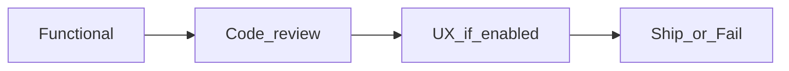

# Verify

Close the work. Every finding ends as a commit, never as a note for the human to act on. The human arrives at a finished PR (agent) or a green HEAD (human). `/implement` runs this skill once the decided analysis parts are done, and `/verify` can be invoked directly if that session died.

Never post findings on a PR (`gh pr review` / `gh pr comment`). Green and fail notes go on the **analysis only**.

Read `docs/agents/issue-tracker.md` and `docs/agents/workflow.md` — run `/setup` if missing. Skills root is the parent of this file's directory. If the repo has a verify overlay, read it after this skill: `docs/agents/verify.md`.

Read `language` from `workflow.md`.

**branch-owner** from `workflow.md`, unless the user overrode it for this session. Read the matching file **now** (agent syncs before the diff):

| branch-owner | File |
|--------------|------|
| `human` | [human.md](human.md) |
| `agent` | [github.md](github.md) |

If `workflow.md` has `## Monorepo` (or nested git repos exist), also read [monorepo.md](monorepo.md).

Do **not** set `ready-to-review` or move to `.scratch/analysis/done/` on a red gate. A red gate ends in `needs-attention` (label on GitHub, `Status:` locally) — it replaces `in-progress`, so the analysis is visibly waiting on a human. Agent still opens or keeps a **draft** PR — **Fail** in [github.md](github.md).

## Phases

1. **Functional** — Spec vs analysis, Standards, local tests + tooling (below)
2. **Code review** — `{skills-root}/code-review/SKILL.md`, always on
3. **UX** — if `workflow.md` has `ux-review: enabled`; else skip
4. **Ship** or **Fail** — path file already read (`human.md` / `github.md`)



## Functional gate (max 3 cycles)

Copy and track:

```
Verify cycle: 1 / 3
- [ ] Spec vs analysis
- [ ] Standards
- [ ] Local tests + AGENTS.md tooling
- [ ] Fixes committed (if any)
```

CI, push, and PR are **not** in this gate — they live in [github.md](github.md).

### Spec source

1. Issue refs (`#123`) via `docs/agents/issue-tracker.md`
2. Path the user passed
3. `.scratch/analysis/NNN-<slug>.md` (not `analysis/done/`), else `docs/` / `specs/`
4. Ask; if none, Spec sub-agent reports "no spec available" — hard failure → **Fail**

From the analysis, read **`## Delivery` → branch name** when present.

### Fixed point

Default: `origin/main` (or repo default) in each affected delivery root. Session may already have a merge-base.

```bash
git -C <path> rev-parse <fixed-point>
git -C <path> diff <fixed-point>...HEAD
git -C <path> log <fixed-point>..HEAD --oneline
```

Single-repo: same in cwd. Need a non-empty diff before Spec/Standards sub-agents.

### Standards sources

`AGENTS.md`, `CLAUDE.md`, `CONTRIBUTING.md`, `CODING_STANDARDS.md`, `docs/adr/`, module `AGENTS.md`. Monorepo: per affected delivery root.

### One cycle

Spec and Standards sub-agents **in parallel**, then local tooling.

**Standards prompt** — per-root diff commands, commit lists, standards files:

> Return a fix-list, not a review. For each affected delivery root run `git -C <path> diff <fixed-point>...HEAD`. Skip empty diffs. Never review the container root. Hard documented-standard violations only. Cite file + rule. Skip judgement and what tooling enforces. Format: `- path: <file> — <rule> — change: <what>`. Empty list = green. Do not post comments. Under 400 words.

**Spec prompt** — per-root diffs, commits, full analysis (`## Acceptance`, `## Change`, `## API Contracts` if present, `## Architecture`, `## FAQ`):

> Return a fix-list, not a review. For each affected delivery root run `git -C <path> diff <fixed-point>...HEAD`. Skip empty diffs. Hard items only: (a) missing or partial `## Acceptance`; (b) scope creep vs `## Change` / `## Architecture`; (c) diff that invents an answer to an open `## FAQ` item; (d) `## Acceptance` behaviour with no test proving it in the diff; (e) non-trivial handler/domain/VO logic in the diff (branches, invariant, calculation, policy) with no unit test proving that logic — HTTP integration alone is not enough; skip (e) for pure wiring with no branches. Open FAQ by itself is not a failure. Format: `- path: <file> — <Acceptance, Change, Architecture, FAQ, or unit-test line> — change: <what>`. Empty list = green. Do not post comments. Under 400 words.

**Local pipeline** — each affected root's `AGENTS.md` (and repo-root `AGENTS.md` if commands live there): full relevant tests, cs-fix / phpstan / typecheck as documented. Fail → fix → re-run. Do not push while local gates are red.

**Outcome:** hard Spec or Standards misses and red tests or tooling fail this gate. Judgement calls are not its business — they belong to the code review phase, which fixes them rather than reporting them.

Failed with fewer than 3 cycles used → fix, then repeat the cycle. 3 Functional failures → **Fail** in the path file already read.

### Fix

One sub-agent per independent failure cluster (sequential if same files). Prompt: analysis Change/Architecture, failing output, `tdd` / `integration-tests` when changing tests, no scope creep, no push/PR, no container-root commits.

Parent re-runs failed commands, then **commits** per `commit/SKILL.md`: `fix(scope): <what failed> (#<N>)`. Trivial one-file fixes: parent, no sub-agent.

## After Functional green

Check off remaining satisfied Acceptance on the analysis, then read and follow `{skills-root}/code-review/SKILL.md` in this session. That phase is always on: it fixes correctness, security, duplication, seam, test-quality and naming problems in code, and reports only what needs a human decision.

Code review green → UX. Code review returns Blocked items, or stays red after 3 cycles → **Fail** in the path file already read.

## After code review green

Read `ux-review` from `workflow.md`:

- `disabled` or missing → **Ship** in the path file already read
- `enabled` → read and follow `{skills-root}/ux-review/SKILL.md` in this session

UX gate green, skipped, or auto-skipped for a non-UI diff → **Ship**. UX gate stops after 3 failures → **Fail**.

### Re-check after gate fixes

Whenever code review or UX review commits a fix, re-run **Local pipeline** on the affected roots — same commands as Functional.

- Red → Fix (Functional rules); counts toward Functional cycles (max 3). Do not Ship.
- Green → resume the gate that was running (code review continues; UX re-walks affected screens only)
- Full Spec/Standards again **only** if the fix changes behaviour vs Acceptance; otherwise skip

## Rules

- Max **3** cycles per gate: Functional here, code review and UX owned by their skills
- Parent commits; fix sub-agents write code
- No commits on the monorepo container root
- No comments, reviews, or inline notes on a PR — analysis only
